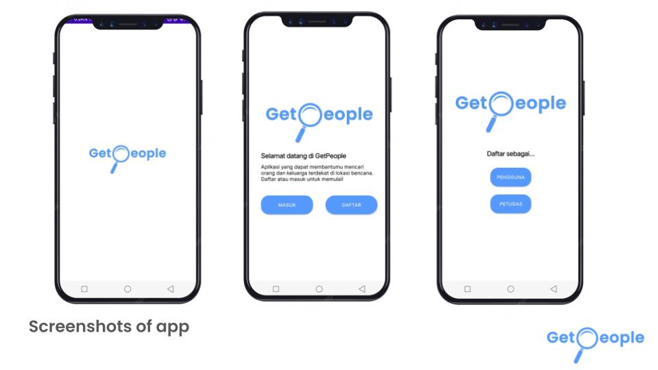
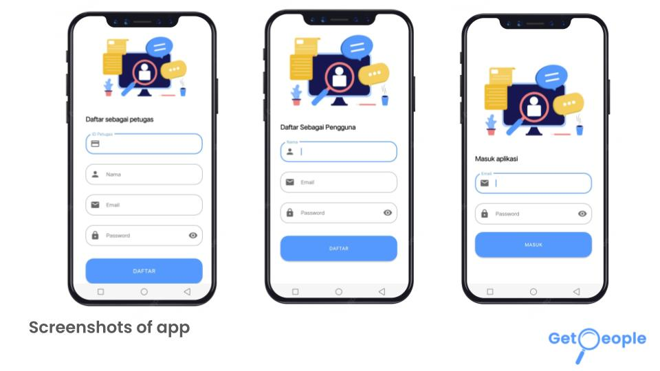
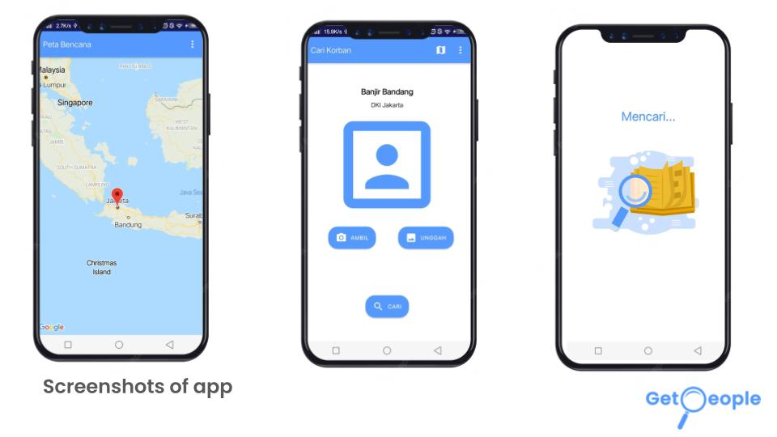
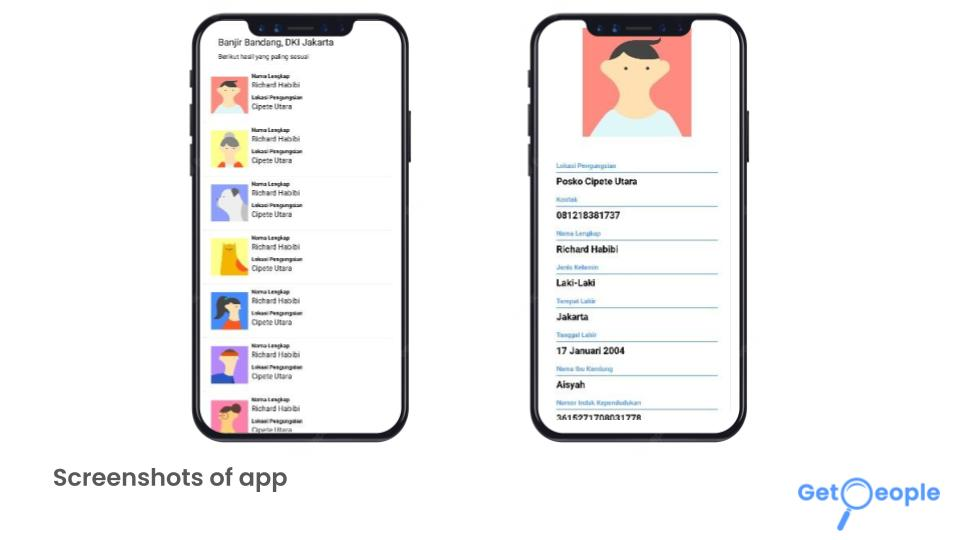
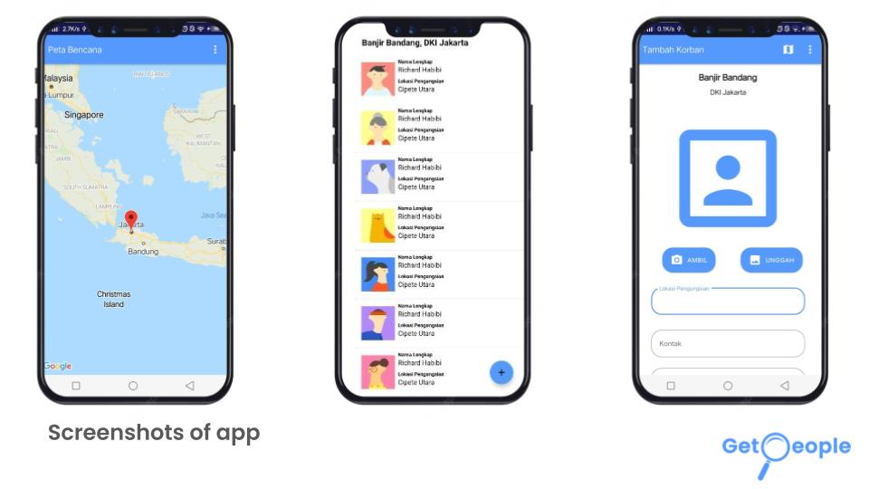

# GetPeople Mobile Development

## About

### Description

GetPeople is an app where people can find their families who becomes victim of a natural disaster just by uploading a photo. Powered by an AI, the app will show victims who have the highest similarities. There are 2 types of user, Pengguna who can find victim by uploading photos and Petugas who can add new victim data.

### Preview

### List of Features

1. Splash screen
2. Welcome page
3. Signup and Login
4. Map of Natural Disaster
5. Find victim by photo (Pengguna only)
6. Add new victim (Petugas only)

### Dependencies and Tools
1. Kotlin Extensions (Core, ViewModel, LiveData)
2. Glide
3. Material Design
4. Constraint Layout
5. CameraX
6. Retrofit, okhttp3 for API
7. Kotlin Coroutines
8. RecylcerView, CardView
9. Datastore, preferences

## Getting Started

### Prerequisite
1. [Android Studio](https://developer.android.com/studio)

2. Java Development Kit (JDK)

3. Android Phone

### Installation  

1. Get an API Key from [Google Maps Platform](https://developers.google.com/maps/documentation/android-sdk/get-api-key)

2. Clone this repository

3. Open the project in Android Studio

4. Enter your API Key in `build.gradle` -> `android` -> `defaultConfig`
    > buildConfigField 'String', 'MAPS_API_KEY', '"your_api_key"'
5. Click `Build` → `Build Bundles(s) / APK(s)` → `Build APK(s)`

6. Wait until you get the notification that it's finished building. Then, click `locate` to locate the .apk file.

7. Move the .apk file to your phone

8. Run the app.
